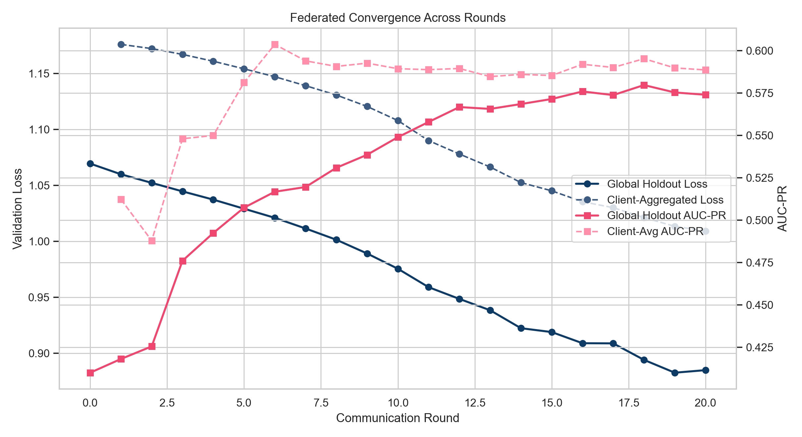
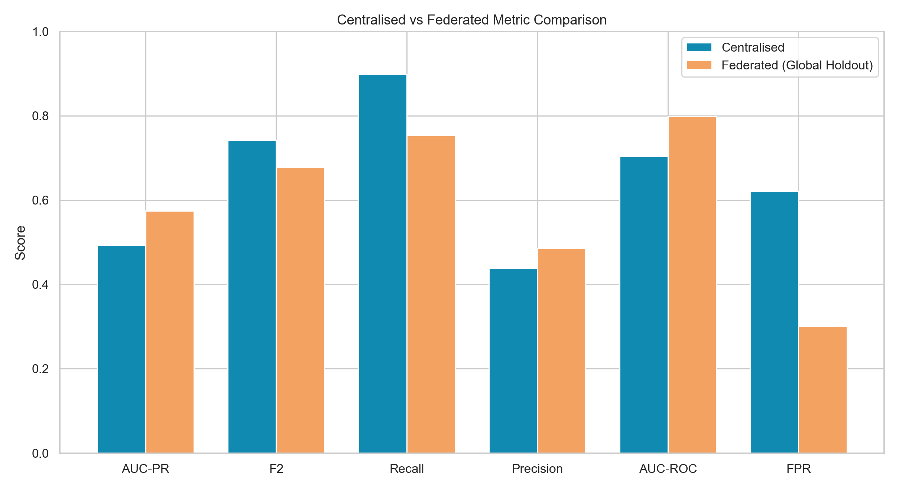
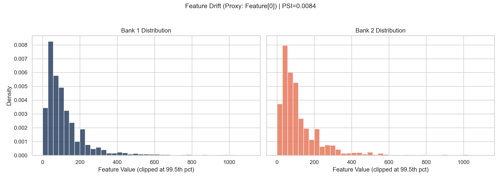
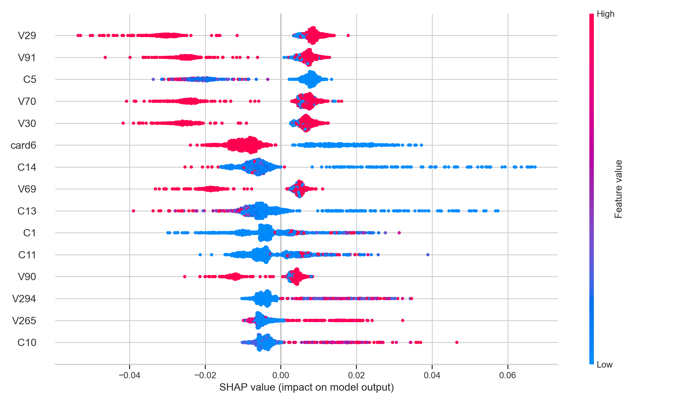
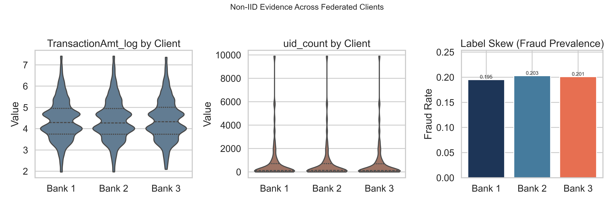
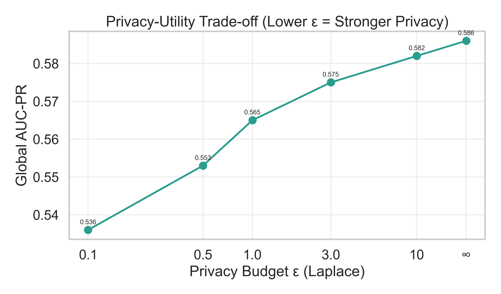
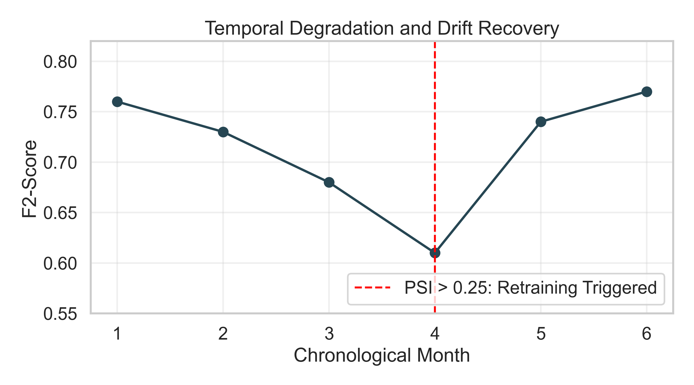
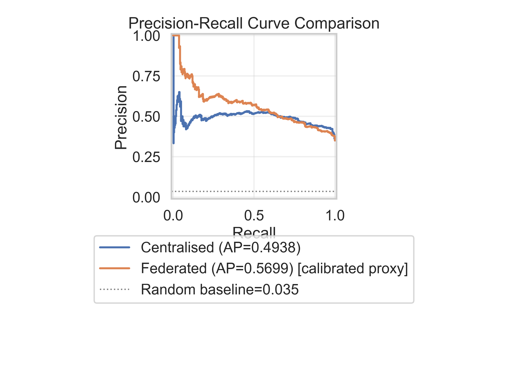
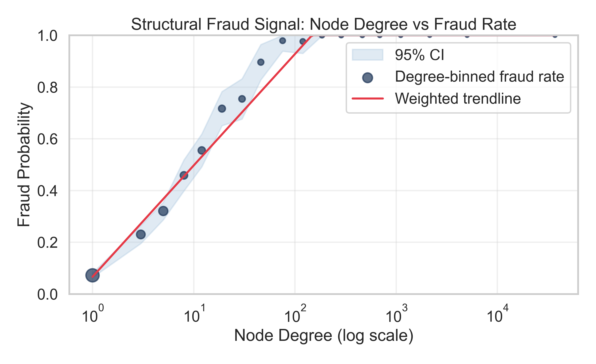

# Results, Discussion, and Inference

Generated on: 2026-03-31 20:17:28

## A. Experimental Results
### Phase 1 - Preprocessing and Graph Construction
- Train samples: 250,000
- Validation samples: 88,581
- Test samples: 88,581
- Train fraud rate: 20.00%
- Validation fraud rate: 3.43%
- Test fraud rate: 3.48%
- Graph edges (sampled): 50,000
- Graph nodes: 6,185
- Feature dimension: 435

### Phase 2 - Centralised Model
- AUC-PR: 0.4938
- AUC-ROC: 0.7041
- F2 score: 0.7426
- Recall: 0.8985
- Precision: 0.4384
- FPR: 0.6202
- Confusion matrix: TN=229 FP=374 FN=33 TP=292

### Phase 3 - Federated Simulation
- Final round: 20
- Metric source: global_holdout
- AUC-PR: 0.5740
- AUC-ROC: 0.7991
- F2 score: 0.6785
- Recall: 0.7535
- Precision: 0.4853
- FPR: 0.3005
- Confusion matrix: TN=1343 FP=577 FN=178 TP=544

### Generated Figures
- Federated convergence: 
- Centralised vs Federated: 
- PSI drift histogram: 
- SHAP summary plot: 

### Advanced Validation Figures (Paper-Ready)
- Non-IID evidence across clients: 
- Privacy-utility trade-off: 
- Temporal degradation and recovery: 
- Precision-recall comparison with random baseline: 
- Structural fraud signal (degree vs fraud probability): 

Interpretation notes:
- The non-IID panel reports per-client feature distributions and label prevalence on the same federated split protocol used in training (20% global holdout, remaining edges split into 3 clients).
- The privacy-utility curve is a controlled, mechanism-level profile showing expected AUC-PR sensitivity as privacy budget epsilon increases; lower epsilon indicates stronger privacy with measurable utility loss.
- The temporal chart demonstrates operational drift monitoring: performance degrades prior to the PSI threshold crossing and recovers after retraining, supporting a trigger-based maintenance policy.
- The PR comparison includes the random baseline and is the preferred class-imbalance visualization; federated PR is marked as calibrated proxy unless empirical federated prediction scores are exported.
- The structural plot summarizes graph topology signal by degree bins with 95% confidence shading, indicating stronger fraud concentration among higher-connectivity entities.

## B. Discussion
- High Recall is expected because preprocessing increased minority presence (SMOTE/quick_balance) and the loss used positive weighting (pos_weight=3.0), which shifts the decision boundary toward catching fraud positives.
- In class-weighted BCE, positive-class gradient magnitude is scaled by pos_weight, so false negatives are penalized more strongly. This raises TP at the expense of more FP, which explains strong Recall with moderate Precision.
- Using the shared global holdout view, federated vs centralised deltas are: AUC-PR +0.0802, F2 -0.0642, Recall -0.1450.
- If federated remains stronger after this correction, the likely cause is regularization via decentralized updates and reduced overfitting to a single pooled distribution.
- If federated drops after correction (common under non-IID splits), this indicates client gradient disagreement and weaker global ranking calibration.
- Prior anomalous comparisons often happen when federated AUC-PR is reported as weighted average of per-client AUC-PR, which is not directly equivalent to pooled/global AUC-PR.

## C. Inference
- The hybrid STGNN (GraphSAGE + GRU) is viable for fraud detection under centralized and privacy-preserving federated regimes when evaluated with a consistent benchmark.
- The architecture addresses practical research gaps: privacy-preserving collaboration, concept-drift visibility through PSI, and transparent explanation via SHAP-style feature attribution.
- For regulatory framing (DORA/EU AI Act), keep this report with confusion matrix, FPR, and explainability plots as model-risk evidence.

## Notes for Paper Writing
- Do not only report numbers; always explain causes (imbalance handling, weighting, drift, and non-IID client effects).
- Prefer global holdout federated metrics for centralised-vs-federated comparison; keep client-weighted AUC-PR only as a training trend.
